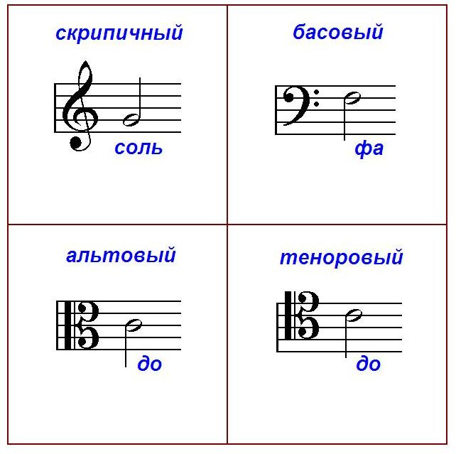
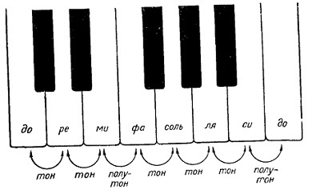
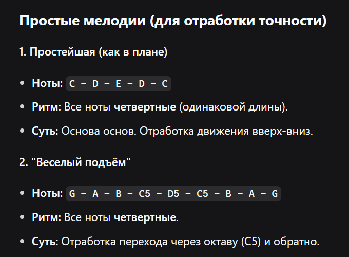
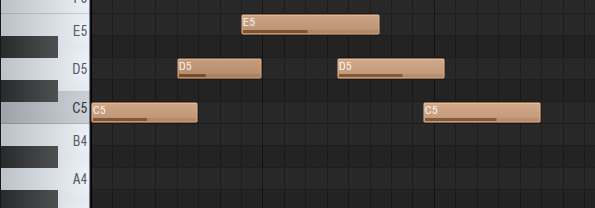
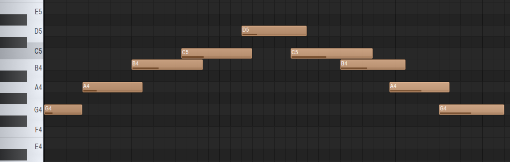
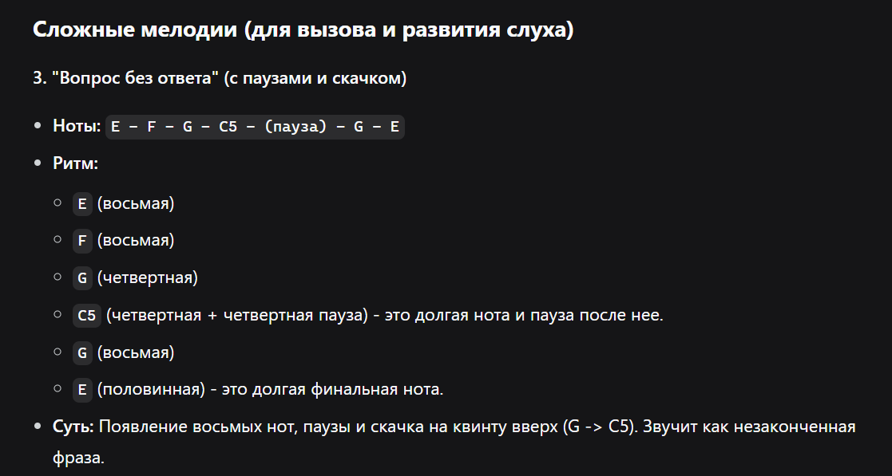
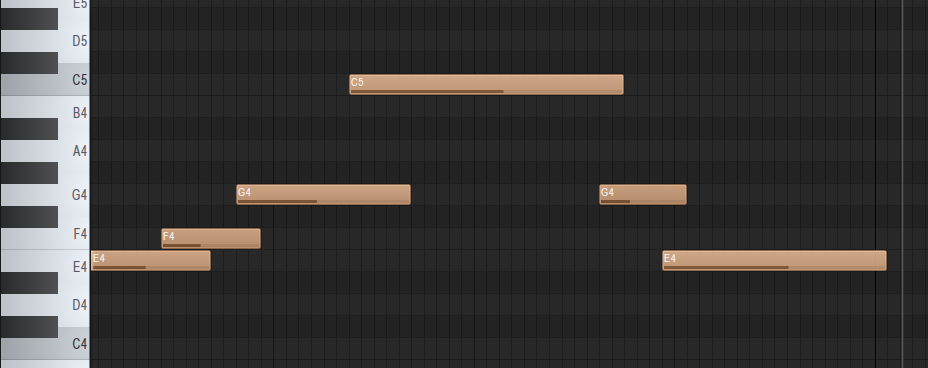
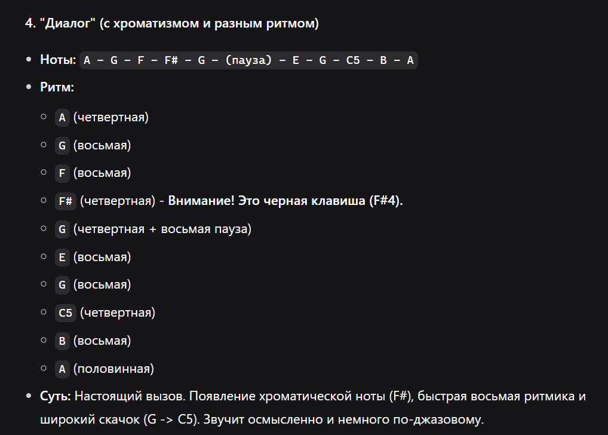
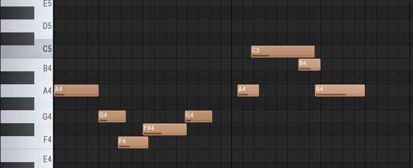

# Занятие 1. Вспоминаем ноты всякие

## Глава 1.2.2. Ноты

вспоминаем где расположены нотки
ассоциации:
	до-мик - ноты до ре ми с двумя черными нотками сверху
	фа-сик - ноты фа соль ля си с тремя черными клавишами сверху
	
октава - расстояние от одной ноты "до" до другой ближайшей ноты "до"

### Упражнение счет нот
берем любоую ноту за 1 и от нее считаем.

#### до - номер 1 
4 - фа
7 - соль
3 - ми

##### Итого: вспомнила где какая нотка есть
## Глава 1.2.3. Нотный стан

Нумерация линеек нотного стана от 1 до 5 наверх
Сущесвуют добавночные линейки - их называют добавочными сверху или снизу

##### Итого: вспомнили вид нотного стана

## Глава 1.2.4. Ключи нотного стана

Для чего нужны ключи? Они обозначают точку отсчета нот на линейке.
Существует три основных ключа:
СОЛЬ ФА ДО

соль - скрипичный ключ - чаще играют на скрипке

фа - басовый - чаще на басс

до - альтовый и теноровый (если поднять на одну линейку) - чаще на альте)

У каждого ключа нотка указывает на какой линейке находится начальная нота.

Так выглядят ключи:

Значок восьмерки в нотном стане используется для того чтобы указать что нота играется на октаву выше

Итого: Освоили навык название белых клавиш и как они обозначаются на нотном стане

## Глава 1.2.5. Буквенное обозначение нот

Тут начальной будет Ля - А и далее по алфавиту

Ля - А

Си - B/H

До - C

Ре - D

Ми - E

Фа - F

Соль - G

## Глава 1.3. Тон и полутон

Полтуон - расстояние между двумя соседними клавишами (черная и бела или белая и белая)
Тон - два полутона

поиграли в игру тон полутон походили по клавиатуре пианино)

## Практическая часть в fl studio с использованием midi клавиатуры 
играю руками на клавиатуре так что ноты могут быть не идеально ровными цель выучить нотки

Реализуем в пиано ролл 4 мелодии:

Для начала простые вот задание:

1. C-D-E-D-C
Это будут ноты до-ре-ми-ре-до

2. G - A - B - C5 - D5 - C5 - B - A - G подъемы
Так как нам нужны прыжки возьмем 4 октаву для начала.
это будет соль - ля - си - до 5 - ре 5 - до 5 - си - ля - соль

Теперь к сложным мелодиям
3. E - F - G - C5 - (пауза) - G - E

это будут нотки ми - фа - соль - до 5 - пауза - соль - ми

4. A - G - F - F# - G - (пауза) - E - G - C5 - B - A

это будет ля - соль - фа - фа диез - соль - пауза - ми - соль - до 5 - си - ля

## Выводы по работе.
Чуть вспомнила запись нот на нотном стане. Вспомнила скрипичные ключи, что такое тон полутон.
Узнала латинскую запись нот и более менее с ней освоилась
научилась медленно но переводить латинскую запись в русскую и записывать ее в пиано ролле.
Пока не очень разобралась что такое четверные и восьмые ноты, но старалась сыграть ритмически верно.
