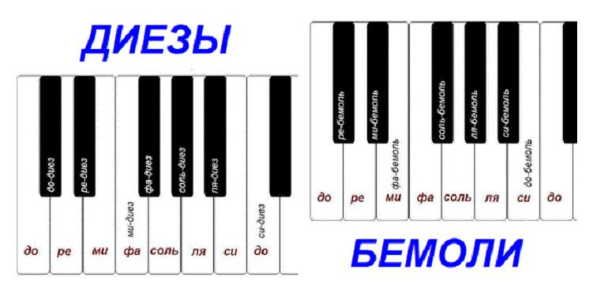
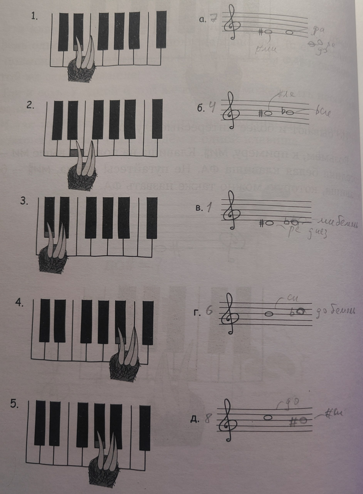
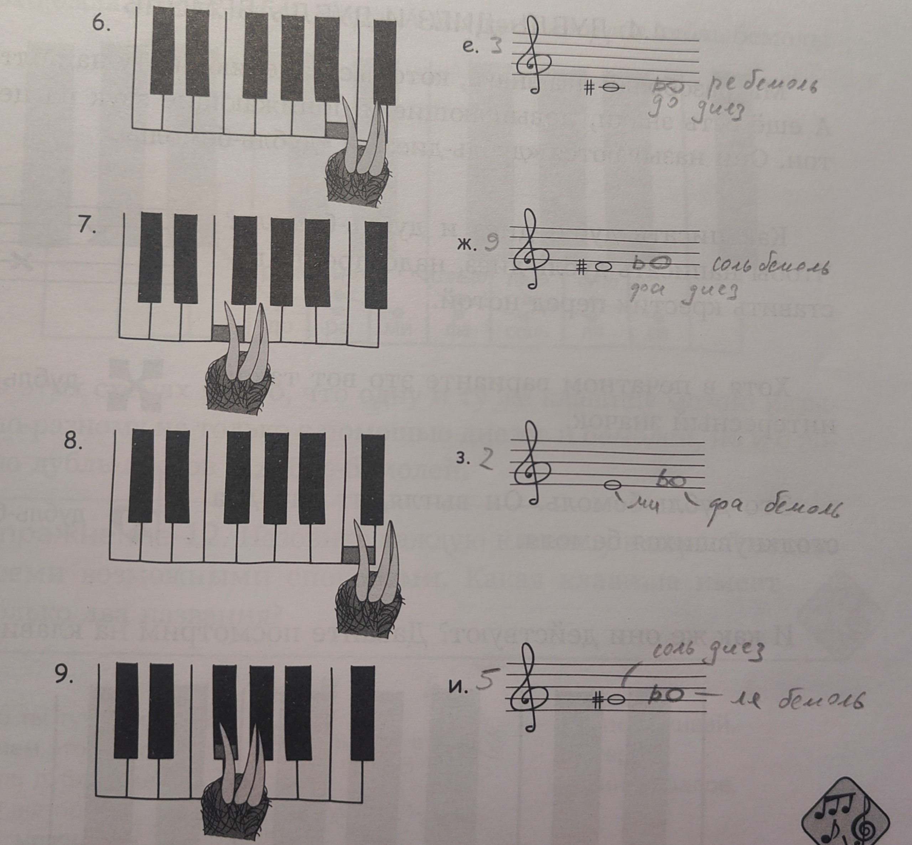
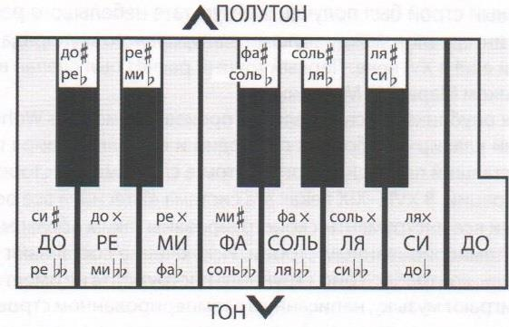
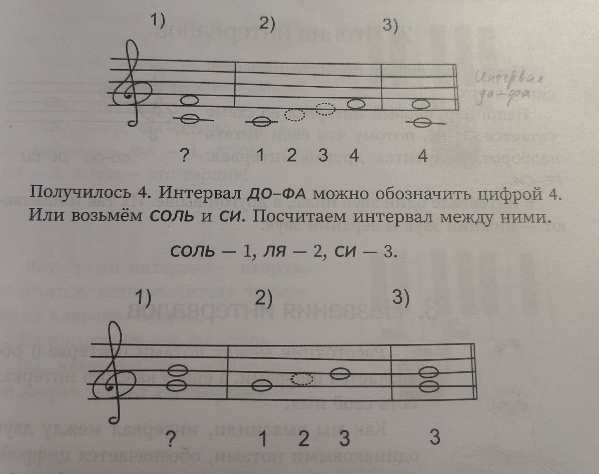
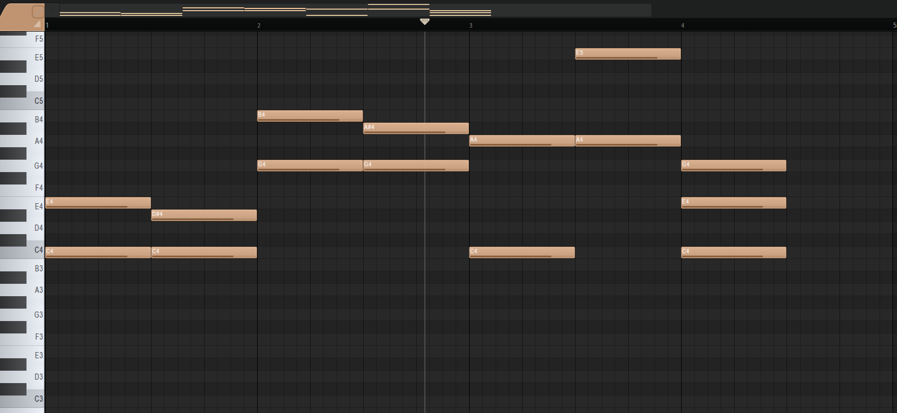

# Занятие 2. Интервалы

Возможно будет чуть скомкано, но допройдем обозначения которые мне уже знакомы и приступим к интервалам - базе аккордов 

## Диез и бемоль - знаки аллитерации

Вспомним что на пианино есть и черные ноты, они своих названий не имеют, чтобы узнать название находим ближайшую белую ноту 

Нота которая будет выше белой на пол тона - диез(обозначают #), например до диез

Нота которая ниже белой на пол тона - бемоль (обозначают b)

Знаки аллитерации строго пишутся:
на одном уровне с нотой

рядом с нотой

перед нотой

Черные ноты могут два раза использоваться - например соль бемоль это та же клавиша, что и фа диез

Одна и та же клавиша может звучать по разному в зависимости от строя инструмента, на пианино например ми бемоль и ре диез звучат одинаково

Энгармонически равные звуки - те что звучат одинаково но записываются по разному.

### Задание на их поиски
Нужно было сопоставить клавишу на пианино и запись, если нота одна, то записать вторую ноту которая соотвутсвует той же клавише.

Существуют также дубль диез (обозначают ## или крестик) и дубль бемоль (обозначают bb) (о чем я кстати не знала)

Они соотвественно будут повышать/понижать ноту не на пол тона, а на тон.
(Очень хорошая терминология чтобы запутаться к чертям)

существует знак бекар который борется со всем выше описанным злом, то есть отменяет любые знаки

у всех этих знаков есть латинские обозначения, но я за свою жизнь ни разу их не встречала может разберу в отдельной справке какой-нибудь.

## Интервалы
В интервале 2 звука нижний и верхний
Ноты интервала принято читать снизу вверх

Интервалы можно обозначать цифрами, а ступени в интервале - ноты (что не совсем корректно)

### Имена интервалов
(мы считаем расстояние по белым клавишам если что)

Прима - расстояние между одинаковыми нотами = 1

Секунда - расстояние между двумя соседними нотами = 2

Терция - расстояние = 3

Кварта - не поверишь расстояние = 4

Квинта (любимая наша) - расстояние = 5

Секста - расстояние = 6

Септима - расстояние = 7

Октава (ну хоть чето родное) - расстояние = 8

Интервалы бывают простые и составные

Простые - те что мы изучили выше - те что меньше октавы

Составные - те что больше октавы и у них там свои страшные названия которые мы оставим занудам)

Составные так же можно обзывать например: терция через октаву - что будет означать пройти 3 нотки от например 'до', но через октаву (это будет 'ми' следующей октавы)

кстати говоря знаки аллитерации не влияют на название интервала....
То есть ля - до и ля - #до это терции... хотя во втором случае мы протопали лишнюю черную нотку... (еще одна фишка чтобы запутаться)

Только вот ля - до будет называться малой терцией, а ля - #до большой терцией

## Как обычно чето потыкаем в fl studio - практическая часть

1. Строим большую и малую терции от ноты C 

терция - 3

С - E - большая и С - #D - малая
(на фото далее это будет первый такт)

2. Аналогично от ноты G

G - B - большая и G - #A
(на фото далее это будет второй такт)

3. Строим квинты от ноты С и А

квинта - 5

С - G и A - E
(на фото третий такт)

4. Соберем мажорное трезвучие С

От ноты C берем большую терцию далее от полученного малую терцию 
Итого С - E - G(4 такт на фото)

## Некие выводы)
Ну сегодня мы поговорили про знаки аллитерации

узнали что такое интервалы и какие они бывают, поучились их строить

все с кайфом)

Сколько пальцев крутится у висков?)

