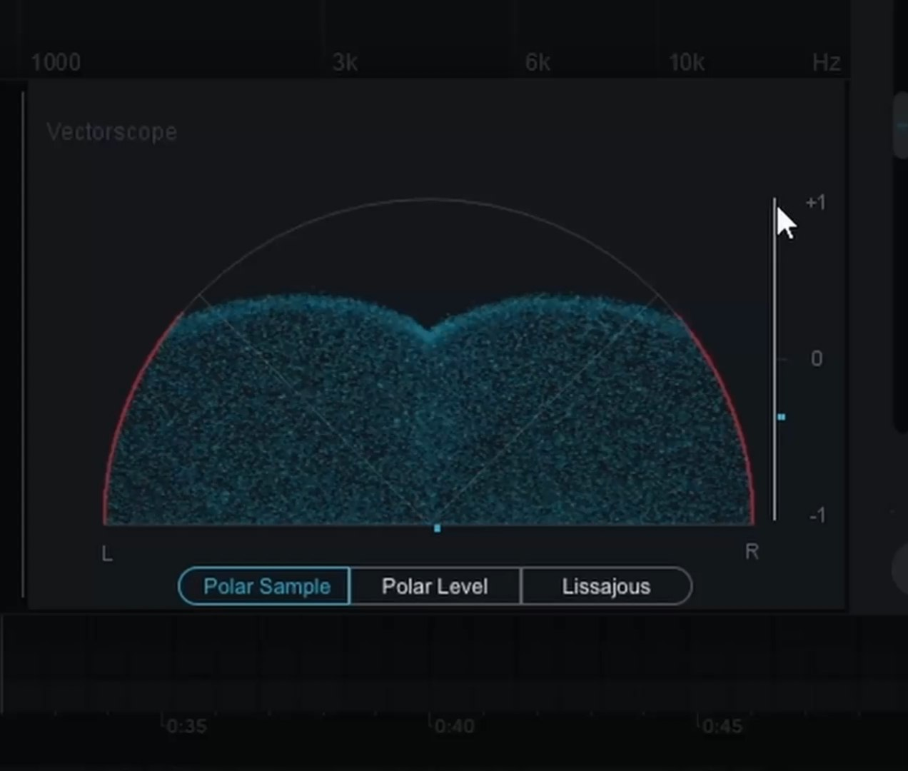

# Как работать на плохом оборудовании?

о наболевшем как работать если все плохо/дешево/отсутсвует

Главное помним что все равно пишем и не закапываемся

## А в чем проблема плохого оборудования то?

В том что ты просто не слышишь какие-то частоты или слышишь их с искажениями

## Ну и че делать?

1. Прослушивать на всех доступных тебе устройствах, вообще на всех (около 5 штучек примерно)

2. Слушать референсы и воровать из них части, понимать как звучит какая-то часть на твоей технике

3. Открываем анализатор (наприме pro Q)

берем референс того же жанра и смотрим АЧХ

ну и вполне можно повторить референсное АЧХ
(можно вполе забить на это и доносить свою идею возвращаемся в пункт 1)

4. Проблемы в фазе (несинхронные дороги)

В izotop imager смотрим показатель вот этот (в моно):

если видим итог как на картинке то есть не около нуля или 1, то все плохо

Это может происходить если инструменты слишком широкие например.
Можно попробовать убрать с них какие-то эффекты или поработать с ними иначе.

около 60-80 делать в моно можно все)

Убираем все части в моно и добавляем потихоньку помаленьку и следим за тем же показателем

5. Комната)

в какой-то части комнаты колонки звучать могут лучше

Основное правило - равносторонний треугольник колонки по бокам смотрят в ушки и не около стены

