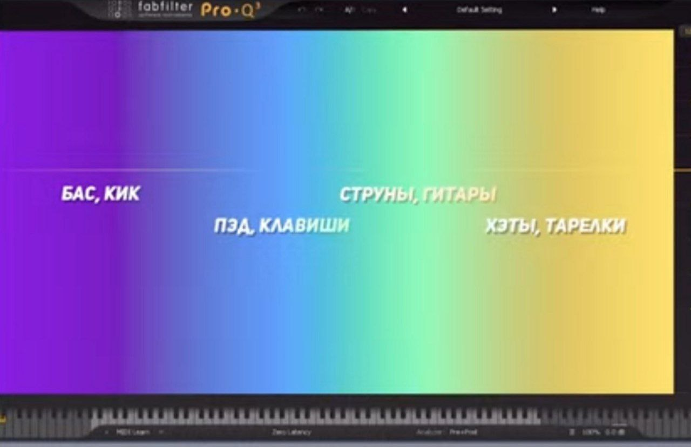

Мы можем слышать от примерно 20 до 20000 герц в этом диапазоне и работаем

соответственно мы резко срежем верх и низ до и после доступных частот 

шпаргалка по расположению инструментов в частотах

но в общем-то каждый инструмент звучит во всей области... оттуда и проблемы

чем сильнее мы влияем на диапазон частот тем сильнее искажается фаза.. если много инструментов это будет критично 

не более 5 вмешательств, но я думаю и того много
#### самое важное 

перед эквалайзером нужно сбалансировать все иначе будете обманываться 
(кстати баланс удобно делать убрав все в 0 и добавляя по одному инструменту)

инструменты не должны конфликтовать между друг другом.

**смотрим в эквалайзере где например два инструмента пересекаются и выбираем кто должен звучать в каком месте**

это основа таким образом и собираем микс как пазл

НО НО в целом достаточно важно никогда не резать ничего в 0, просто ищи звуки которые дополняют друг друга)
#### чуток про эффекты

база что можно использовать для эффектов я это уже делала)
если срезать верха получим эффект под водой
если срезать низ получим эффект телефона

#### работа в разных сторонах

существует функция урезания частот в левой/правой/мид/сайд частях

мид -  все что идёт по центру (вокал и басс например )
сайд - все по сторонам ширина
#### чуток про вокал в мелодию

чтобы уложить вокал в мелодию и избежать диссонансы
можно отправить вокал к мелодии через сайдчейн (стрелочкой и правой кнопкой)

далее в настройках sooth (шестеренка - processing - в sidechain input выбираем дорогу вокала)

